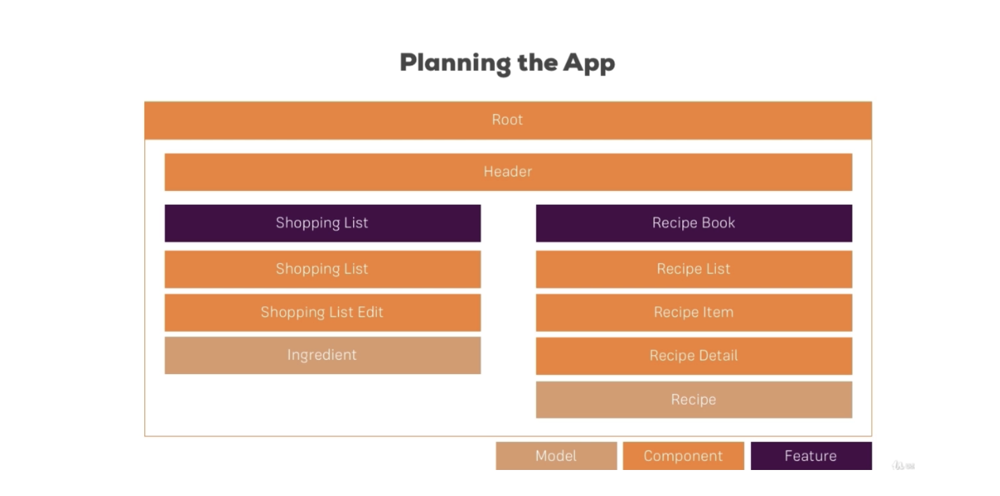
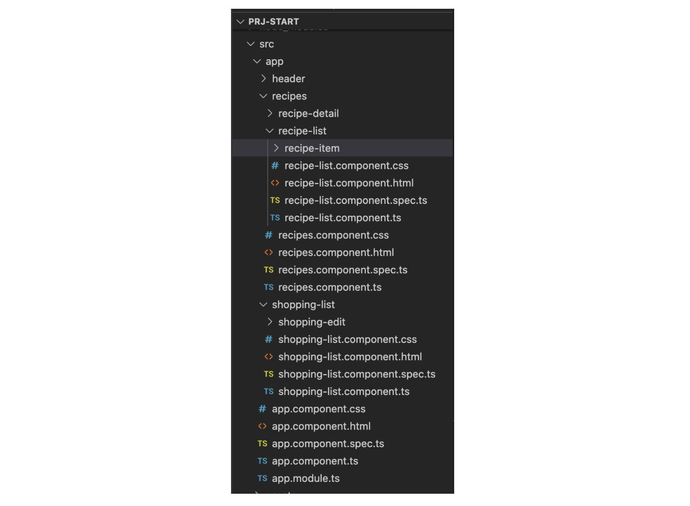
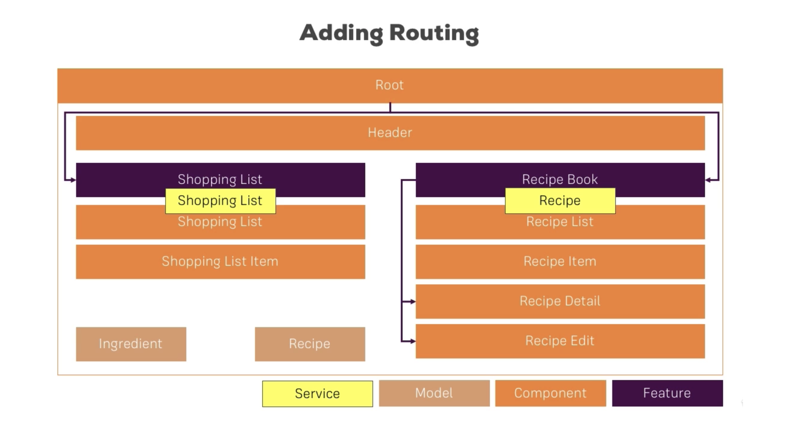
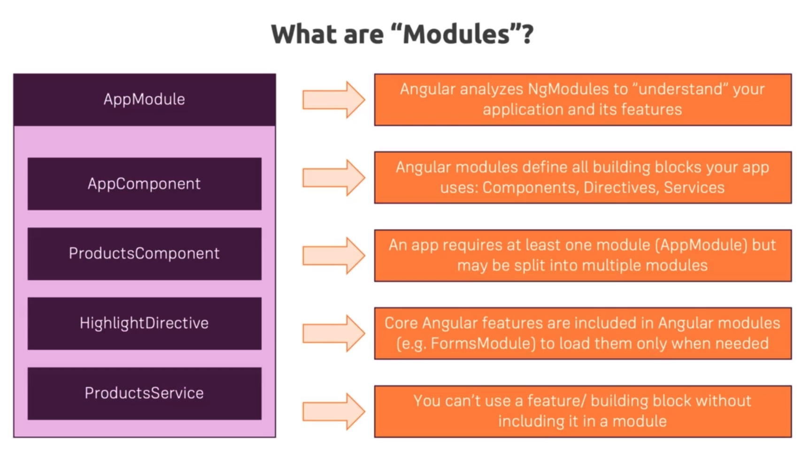
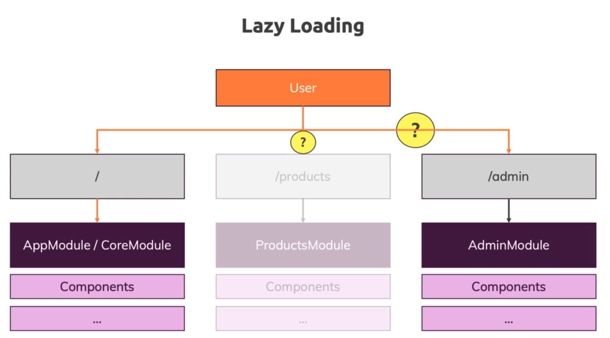
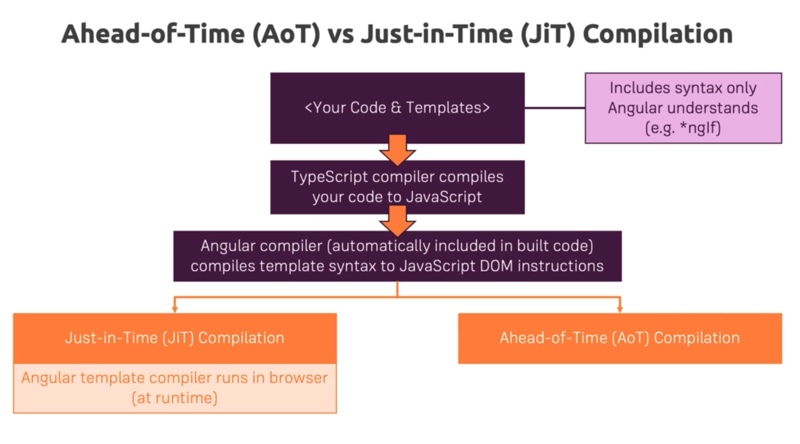

# Angular Project




### The Basics


1. Structure 




2. add navigation

3. create recipe model in `/recipes/recipe.model.ts`

4. loop recipes in the `recipe-list.component.html`

5. add element in the `recipe-detail.component.html`

6. create ingredient model in the `shared/ingredient.model.ts`

7. import ingredient in the `shopping-list.component.ts` and render it in the `shopping-list.component.html`

   

### Component & Databinding

1. allow navigation to switch arount `Recipes` and `shopping list`
   1. add click event in the `header.component.html`
   2. add `onSelect` in the `header.component.ts` and emit selected option to `app` component
   3. in the `app` component, implement the switch function 

2. passing recipe data from `recipe-list-component` to `recipe-item-component`
3. passing recipe data from `recipe-item-component` to `recipe-list-component` to `recipe-component` and then passing it to `recipe-details-component`
4. use `local reference ` and `view child`  to get data from `shopping-edit.component.html`  and pass it to `shopping-list component`


### Driectives

1. Create `dropdown.directive.ts` under `shared`

   

```typescript

import { Directive, HostBinding, HostListener } from "@angular/core";

@Directive({
  selector: "[appDropdown]",
})
export class DropdownDirective {
  @HostBinding("class.open") isOpen = false;
  @HostListener("click")
  toggleOpen() {
    this.isOpen = !this.isOpen;
  }
}

```


**dropdown can also be closed by a click anywhere outside (placing the listener not on the dropdown, but on the document**


```typescript

import { Directive, ElementRef, HostBinding, HostListener } from "@angular/core";

@Directive({
  selector: "[appDropdown]",
})
export class DropdownDirective {
  @HostBinding("class.open") isOpen = false;

  @HostListener(" document:click", ["$event"])
  toggleOpen(event: Event) {
    this.isOpen = this.elRef.nativeElement.contains(event.target)
      ? !this.isOpen
      : false;
  }
  constructor(private elRef: ElementRef) {}
}

```


2. bring `appDropdown` to `recipe-detail.component.html` and `header.component.html`


### Services and Dependency Injection


**deal with recipes**


1. create `recipe.service.ts` under `recipes`
2. bring `recipeService` to `recipes.component.ts` as a provider 
3. update `recipes` in the `recipe-list.component.ts`ßß


use of `EventEmitter` in the services

4. add `recipeSelected = new EventEmitter<Recipe>();` to `recipe.service.ts`

5. in the `recipe-item.component.ts` , emit selected recipe directly

   

```typescript

onSelected() {
    // this.fireSelectedRecipe.emit();
    this.recipeService.recipeSelected.emit(this.recipe);
  }

```


5. in the `recipes.component.ts`, get the selected recipe directly

```typescript

  ngOnInit(): void {
    this.recipeService.recipeSelected.subscribe((recipe: Recipe) => {
      this.selectedRecipe = recipe;
    });
  }
  
```


**deal with Ingredient**

1. Create `shoppingList.service.ts`
2. Update `shopping-list.component.ts`
3. update `shopping-edit.component.ts`


**add recipe ingredient in the `recipe-detail.component` to `shopping list`**

1. Modify `recipe-detail.component.ts` (add `  onAddToShoppingList`)
2. add `  addIngredientsToShoppingList` in the `recipe.service.ts`
3. add `  addIngredients` in the `shoppingList.service.ts`


### Routing




1. create `app-routing.module.ts` and bring it to the `app.module.ts`
2. modify `app.component.html` (add `router-outlet`)
3. deactive all the links

**Add child route**

4. Modify `app-routing.module.ts`
5. modify `recipes.component.html`
6. modify `recipe-detail.component.ts`  and add `getRecipe` to `recipe.service.ts`
7. get the index of recipe-item by modifying `recipe-list.component.html` and `recipe-item.component.ts` as well as `recipe-item.component.html`
8. add `recipe-edit component` and bring it to the `app-routing.module.ts`
9. modify `recipe-edit component`


### Forms

**Template Driven approach**

1. edit `shopping-edit.component.html` and `shopping-edit.component.ts` to use angular form
2. implement the edit function
   1. add `startEditing = new Subject<number>();` and `addIngredient` in the `shoppingList.service.ts` 
   2. emit selected item from `shopping list component` to `shopping-edit.component` by editing files in the two components

**Reactive approach**

1. modify `recipe-edit.component.html`
2. modify `recipe-edit.component.ts`
3. modify `recipe.service.ts`


### Http

1. create `data-storage.service.ts` under `shared`
2. imort `HttpClientModule ` in the `app.module.ts`
3. add `  onSaveData` in the header component


**Add `resolver` to make sure data is loaded whenever entering the page**

1. create `recipes-resolver.service.ts`
2. Modify `fetchRecipes` in the `data-storage.service.ts` and `header.component.ts`
3. add `resolve: [RecipeResolverService],` in the `app-routing.module.ts`


### Authentication


In the recipe book project

1. create a new component called `auth` and add `auth.component.html` and `auth.component.ts ` and bring it to the `app.module.ts`
2. add `AuthComponent` to the route in the `app-routing.module.ts`

3. create `auth.service.ts` to mange signin user etc.


**Add loading spinner**

1. https://loading.io/css/
2. Create `loading-spinner component` under `shared`
3. import  `loading-spinner component`  into `app.module.ts`
4. use  `loading-spinner component`  in the auth component


**Maintain user login information**

1. create `user.model.ts` under `auth`
2. import the user model to `auth.service.ts` and save login or registered users
3. use the `user subject` in the `header component`

since fetching or saving request needs to have user token

4. modify `user = new BehaviorSubject<User>(null);` in the `auth.service.ts`

5. modify methods in `data-storage.service.ts`

6. create `auth-interceptor.service.ts` in the `auth` folder

7. import `auth-interceptor.service.ts` in the `app.module.ts`

   

8. create `  logout` in the `auth.service.ts` and import it into `header component`

   

**Use local storage to store user information** 

9. modify `handleAuthentication` in the `auth.service.ts`
10. add `autoLogin` in the `auth.service.ts`
11. Use the `autoLogin` in the `app.component.ts`


**autoLog out if the token expires**

12. add `autoLogout` in the `auth.service.ts` 
13. bring `autoLogout` to `handleAuthentication` and `autoLogin`


**Add Auth Guard**

14. create `auth.guard.ts` under `auth`
15. import `AuthGuard` in the `app-routing.module.ts`


### Dynamic Components


1. create `alert` component under `shared` folder
2. import `AlertComponet` to `app.module.ts`
3. use alert in the `auth.component.html`


### Angular Modules & Optimizing Angular Apps





### Splitting Modules

Example: Recipe module 

1. Create `recipes.module.ts` under `recipes`  folder

2. move all recipes relared components to the `recipes.module.ts` and import ` RecipesModule` in the `app.module.ts`

3. Import `RecipesRoutingModule,` in the `recipes.module.ts`

   

**Share Modules**

1. create `shared.module.ts`
2. import `shared.module.ts` in the `recipes.module.ts` `shopping-list.module.ts` (they use `CommonModule,` in the `share module.ts`) and `app.module.ts`


**Core Module**

core module is used to replaced the `providers` in the `app.module.ts`


1. create `core.module.ts`
2. import `core.module.ts` in the `app.module.ts`


**Auth Module**


### Lazy Loading





**Recipes routing** example

1. in the `recipes-routing.module.ts` , change the path to ''

```typescript
// path: 'recipes',
    path:'',
      
```


2. in the `app-routing.module.ts`, modify the appRoutes

```typescript
const appRoutes = [
  { path: '', redirectTo: '/recipes', pathMatch: 'full' },
  // for lazy loading
  {
    path: 'recipes',
    loadChildren: () =>
      import('./recipes/recipes.module').then((m) => m.RecipesModule),
  },
];
    
```


3. in the `tsconfig.app.json`, set:

```typescript
    "module": "esnext",
      
```


### preloading lazy-loaded code


```typescript
// app-routing.module.ts

@NgModule({
  imports: [
    // preloading lazy-loaded code
    RouterModule.forRoot(appRoutes, { preloadingStrategy: PreloadAllModules }),
  ],
  exports: [RouterModule],
})
```


 


### Ahead of Time Compilation



```bash
$ ng build --prod
```


### Deployment

1. ```bash
   $ sudo npm install -g firebase-tools
   ```

2. ```bash
   $ firebase login
   ```

3. ```bash
   $ firebase init
   ```

4. ```bash
   $ What do you want to use as your public directory? dist/my-first-app
   ```

5. ```bash
   $ File dist/my-first-app/index.html already exists. Overwrite? (y/N) N
   ```

6. ```bash
   $ firebase deploy
   ```


```bash
Hosting URL: https://ng-recipe-book-27711.web.app
```


testing account:


admin1@example.com

12345678

